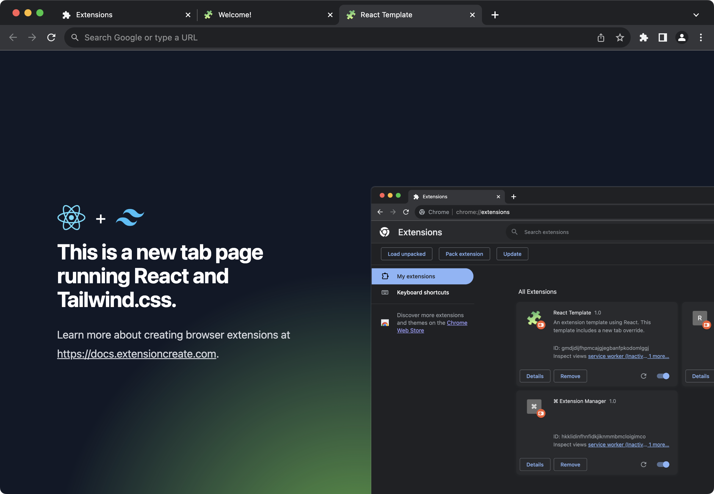

React is the library for web and native user interfaces.	

`Extension` offers built-in support for React and JSX. To have support for React in your extension, ensure you have [React](#) and [React-DOM]() set as a `dependency` or `devDependency` in your `package.json` file, and you are all set!

## Starter React Template 

Extension comes with a default React template for new projects, which you can use as a starting point for your next React-based Extension. This is the easiest way to have React integrated with Extension.



### Try it yourself 

```sh
npx extension create my-extension --template=react
```

## React+TypeScript Template

Alternatively, `Extension` also supports a React+TypeScript template for a more robust UI.


### Try it yourself 

```sh
npx extension create my-extension --template=react-typescript
```

## Usage With An Existing Extension 

### Intallation

```sh
# Install required dependencies
npm install -D react react-dom @types/react @types/react-dom
```

### Configuration

`Extension` expects your React files to come from the following file extensions:

* If TypeScript is not enabled: `*.jsx`, `*.mjsx`
* If TypeScript is enabled: `*.tsx`, `*.mtsx`

### Usage

#### In a JavaScript File 

To use React in a JavaScript file, add it as a `<script>` for your HTML file:

```html
<!DOCTYPE html>
<html lang="en">
  <head>
    <meta charset="utf-8" />
    <meta name="viewport" content="width=device-width, initial-scale=1" />
    <title>New Extension</title>
  </head>
  <body>
    <noscript>You need to enable JavaScript to run this extension.</noscript>
    <div id="root"></div>
  </body>
  <script src="./Index.jsx"></script>
</html>

```

```js
// Index.jsx
import React from 'react'
import ReactDOM from 'react-dom/client'
import NewTabApp from './NewTabApp'

const root = ReactDOM.createRoot(document.getElementById('root'))

root.render(
  <React.StrictMode>
    <MyExtension />
  </React.StrictMode>
)

```

```js
// MyExtensionx

export default function MyExtension() {
  return (
    <h1>Hello, Extension!</h1>
  )
}
```


#### In A `content_script` File 

Scripts defined as `content_scripts` inherit the HTML from the tab they are allowed to run. If you don't know beforehand the HTML element you want to inject React into, you can create one and render it as any other pre-made HTML element.

```js
import React from 'react'
import ReactDOM from 'react-dom/client'

// Styles are set as dynamic imports in content_scripts.
import('./content.css')
import MyExtension from './MyExtension'

setTimeout(initial, 1000)

function initial() {
  // Create a new div element and append it to the document's body
  const rootDiv = document.createElement('div')
  rootDiv.id = 'extension-root'
  document.body.appendChild(rootDiv)

  // Use `createRoot` to create a root, then render the <App /> component
  // Note that `createRoot` takes the container DOM node, not the React element
  const root = ReactDOM.createRoot(rootDiv)
  root.render(<MyExtension />)
}
```

## Next Steps

* Learn more about [[Manifest Capabilities]].

---

**🧩 Extension** • create cross-browser extensions with no build configuration.
