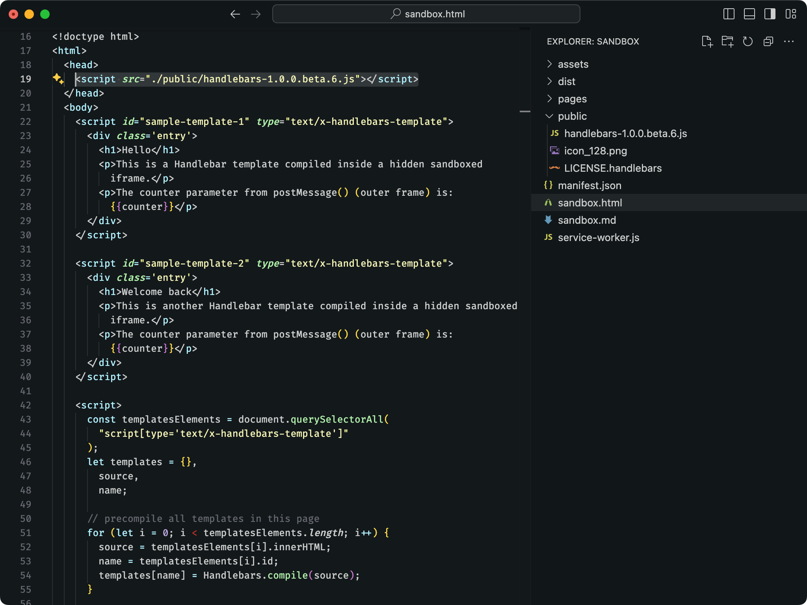

During development, sometimes we need a standalone script or page that adds extra functionality to an extension. It could be an iframe in a sandboxed page, or a script to be used as a content_script via `chrome.scripting.executeScript`. Given these features can be a core part of your extension development, they need the same support as any other file handled by the manifest file, like support for TypeScript, pre-processors and all other features provided by extension-create.

This is the use case of the special folders.

Special folders are folders that allows you to work with files outside the scope of the manifest file. Since `extension-create` uses the manifest to generate the assets, files outside its scope are not bundled by default -- unless they are in a special folder.

| Folder Name | Description |
|-------------|-------------|
| `pages/`    | Allows adding complementary HTML pages to the compilation process, handling its resources as any other HTML file from the manifest. |
| `scripts/`  | Allows adding script files to the compilation process that are not present in the manifest file or HTML pages.                      |
| `public/`   | Allows adding static assets to the output directory without bundling. These files are not processed by extension-create.            |

## Handling HTML Pages

To work with complementary HTML files (such as internal page links or iframes), add the file into a `pages/` folder.

**Example:** 
An iframe as a sandboxed frame. [See the sandbox sample from Chrome Samples repository](https://github.com/GoogleChrome/chrome-extensions-samples/tree/main/api-samples/sandbox/sandbox). The iframe is likely to be edited several times during development, so adding it inside a `pages/` folder guarantees support for hot page reloads and full integration with JavaScript/CSS pre/post-processors.

## Handling Script Files

For scripts without the need of HTML files, add the file into a `scripts/` folder. Any JavaScript-like file in this folder is a valid entry point.

**Example:** 
* Scripts injected via <code>chrome.scripting.executeScript</code>. [See the scripting sample from Chrome Samples repository.](https://github.com/GoogleChrome/chrome-extensions-samples/tree/main/api-samples/scripting) where the API is called to request a script not defined in the `manifest.json` file. Adding the script to a `scripts/` folder guarantees support for hot page reloads and full integration with JavaScript/CSS pre/post-processors.

## Handling Static Assets

For files that you don't want extension-create to parse, or if you want a predictable output path, add your files to the `public/` folder, like `<your-project>/public/icon/subfolder/icon.png`. Any file added to this folder will be copied to the output path as-is. 

See thee example below using the previous [sandbox sample from Chrome Samples repository](https://github.com/GoogleChrome/chrome-extensions-samples/tree/main/api-samples/sandbox/sandbox). `handlebars.js` is an external lib that we don't want to parse, so we add it to the `/public` path, and `extension-create` will output the file as-is, skipping the compilation process.

## Next Steps

- Check the diffent types of [[Templates]] to bootstrap your next extension.
- Learn more about how `extension-create` handles [[Manifest Compatibility Checker]].

---

**🧩 extension-create** • create cross-browser extensions with no build configuration.