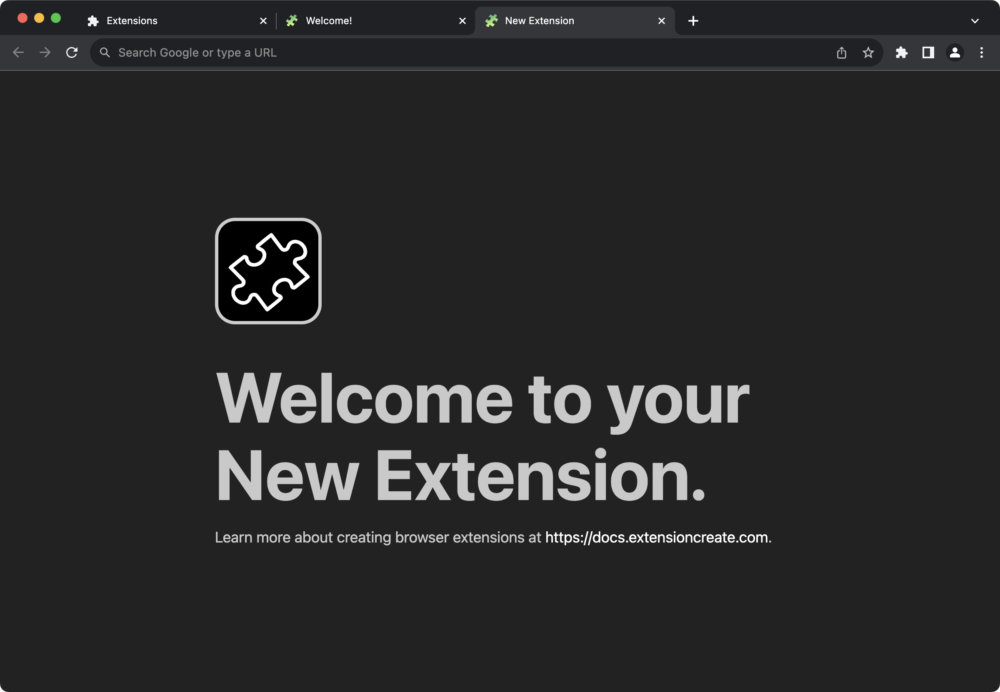
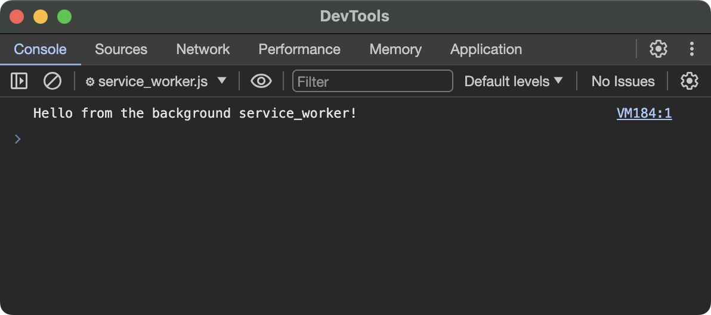

Browser extensions can do many things.

One of the major challenges of developing an extension from scratch (and main motivation to start this project) is the lack of full manifest features support provided by the many frameworks/boilerplates/templates currently available.

With that in mind, `extension-create` is designed to ensure that most of `manifest.json` features are covered for the various extension fields available.

### Manifest Support

Except for browser [Themes](https://developer.chrome.com/docs/extensions/develop/ui/themes#manifest), extension-create offers full Chrome Manifest V2 and V3 support, and plans to cover all manifest features in a cross-browser way, following the [MDN compatibility table](https://developer.mozilla.org/en-US/docs/Mozilla/Add-ons/WebExtensions/Browser_compatibility_for_manifest.json). If there is a feature that is not covered but should, [you are encouraged to open an issue](https://github.com/cezaraugusto/extension-create/issues/new).

> By **_supports_**, we mean live-reload of changes in the browser chrome interface (outside of web ui context) and handling of all file paths in the manifest as entrypoints, allowing full asset handling and output organization of your extension.

Cross-browser manifest support is not something straightfoward as well, so extension-create also offers a [[Manifest Compatibility]] handler that warns and errors when a mistake is found, to ensure your extension matches the criteria of each browser vendor.

### HTML Support

Fields like the action page and browser page overrides runs in the context of an HTML page. Adding any of these fields to your package JSON will make your .html file an entrypoint for your extension.

> A new extension from extension-create.

| Manifest Field                   | File Type Expected |
|----------------------------------|--------------------|
| `action.default_popup`           | .html               |
| `background.page`                | .html               |
| `browser_action.default_popup`   | .html               |
| `chrome_url_overrides.bookmarks` | .html               |
| `chrome_url_overrides.history`   | .html               |
| `chrome_url_overrides.newtab`    | .html               |
| `devtools_page`                  | .html               |
| `options_ui.page`                | .html               |
| `page_action.default_popup`      | .html               |
| `sandbox.pages`                  | .html               |
| `sidepanel`                      | .html               |
| `sidebar_action.default_panel`   | .html               |

### Icons Support

Browser extensions use icons to differentiate your extension in different extension contexts.

| Manifest Field                 | File Type Expected |
|--------------------------------|--------------------|
| `action.default_icon`          | .png, .jpg, ...Other image formats           |
| `browser_action.default_icon`  | .png, .jpg, ...Other image formats           |
| `theme_icons`                  | .png, .jpg, ...Other image formats           |
| `icons`                        | .png, .jpg, ...Other image formats           |
| `page_action.default_icon`     | .png, .jpg, ...Other image formats           |
| `sidebar_action.default_icon`  | .png, .jpg, ...Other image formats           |

### JSON Fields

The `chrome.declarativeNetRequest` API [is used to block or modify network requests by specifying declarative rules](https://developer.chrome.com/docs/extensions/reference/api/declarativeNetRequest), and 
The `storage.managed_schema` property [indicates a file within the extension that contains the policy schema](https://developer.chrome.com/docs/extensions/reference/manifest/storage). Both of these features rely on JSON files to work, which extension-create both support. 

| Manifest Field              | File Type Expected |
|-----------------------------|--------------------|
| `declarative_net_request.rule_resources`   | .json               |
| `storage.managed_schema`                   | .json               |

### Scripts Fields

Support for both `background.scripts` (Manifest V2) and `background.service_worker` (Manifest V3). All scripts have [hot-module-replacement](https://webpack.js.org/concepts/hot-module-replacement/) support, except for `background.service_worker` (which is live-reloaded).

| Manifest Field                 | File Type Expected |
|--------------------------------|--------------------|
| `background.service_worker`    | .js, .jsx, .ts, .tsx, .mjs, .mjsx, .mts, .mtsx |
| `background.scripts`           | .js, .jsx, .ts, .tsx, .mjs, .mjsx, .mts, .mtsx |
| `content_scripts.js`           | .js, .jsx, .ts, .tsx, .mjs, .mjsx, .mts, .mtsx |
| `content_scripts.css`          | .css, .scss, .sass, .less                      |
| `user_scripts.api_script`      | .js, .jsx, .ts, .tsx, .mjs, .mjsx, .mts, .mtsx |

### Web Accessible Resources

According to [Chrome Developers documentation](https://developer.chrome.com/docs/extensions/reference/manifest/web-accessible-resources): 

> Web-accessible resources are files inside an extension that can be accessed by web pages or other extensions. Extensions typically use this feature to expose images or other assets that need to be loaded in web pages, but any asset included in an extension's bundle can be made web accessible.

In extension-create, assets imported in `content_scripts` are set as `web_accessible_resources` by default.

## Next Steps

* Learn how you can handle complimentary files in your extension via [[Special Folders]].

---

**🧩 extension-create** • create cross-browser extensions with no build configuration.
