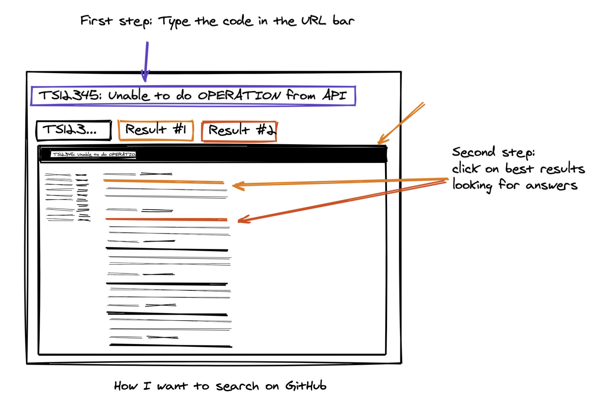

To learn how to create an extension from scratch using `Extension`, let's create one together, from scratch.

Take a common task for some developers: searching on GitHub.

**The problem:** I want to search on GitHub in the most convenient way. Imagine searching GitHub projects directly from your browser's URL bar.

The solution? Meet `github_search`, a tool that makes this possible. 



## The Plan

Our goal is to make GitHub project searches as easy as searching on Google. To avoid irrelevant searches when the user decides to search something else, let's reserve a keyword for our extension. If the user types "gh", followed by a space, will activate our extension to trigger our search. 


> The interface that we are creating here.

## Step 1 - Create the extension

Let's use the `create` command to bootstrap a minimal extension for us using the "init" template. Let's call it: `github-search`

```
npx extension@latest github-search --template=init
```


## Step 1 - Create the manifest file

<div style="position: relative; padding-bottom: 62.5%; height: 0;"><iframe src="https://www.loom.com/embed/1193dc69f7b74a56a5f5d9e0324c255d?sid=99132929-4c05-40e7-b804-3f242daf95ea" frameborder="0" webkitallowfullscreen mozallowfullscreen allowfullscreen style="position: absolute; top: 0; left: 0; width: 100%; height: 100%;"></iframe></div>

> Step 1 Demo

Every extension starts with a manifest file. It tells the browser information about the extension's metadata, permissions, and files that the extension needs to run properly. Based on the [plan above](#plan), we want a custom search shortcut "gh" that will link us to GitHub search. We are also adding a service_worker script to handle user events logic.

```jsx
{
  "manifest_version": 3,
  "name": "GitHub Search",
  "version": "1.0",
  "omnibox": {"keyword" : "gh"},
  "permissions": ["http://www.github.com/"],
  "background": {
    "service_worker": "service_worker.js"
  }
}
```

- `background.service_worker` will let us react to the custom search events.
- `permissions` define the capabilities of our extension.
- `omnibox` keyword "gh" sets our activation word in the URL bar.

## Step 2 - Create the Service Worker

Next, we need a script that listens for our keyword and searches GitHub. Create a `service_worker.js` file with this code:

```js
chrome.omnibox.onInputEntered.addListener((text) => {
  const url = `https://github.com/search?q=${encodeURIComponent(text)}&type=issues`
  chrome.tabs.create({ url })
});
```

This script opens a new tab with GitHub search results whenever you enter something after "gh" in the URL bar.

## Step 3 - Load Your Extension

If you take a looka t your `package.json` file now, it looks more or less like this:

```json
{
  // ...your extension metadata
  "scripts": {
    "dev": "extension dev",
    "start": "extension start",
    "build": "extension build"
  },
  "devDependencies": {
    "extension": "latest"
  }
}

```

These scripts are the main scripts used by `Extension` for development mode. To preview your extension, let load it for the first time.

```
npm run dev
```

If all goes well, you should see a screen like the following:

<div style="position: relative; padding-bottom: 62.5%; height: 0;"><iframe src="https://www.loom.com/embed/777544977a32444ba6de4ff23bdaccbc?sid=360eb1b1-af3a-480b-9e71-41a7fb01ca6e" frameborder="0" webkitallowfullscreen mozallowfullscreen allowfullscreen style="position: absolute; top: 0; left: 0; width: 100%; height: 100%;"></iframe></div>

## Step 4 - Making It Better

To improve our extension, let's add search suggestions directly in the URL bar by listening to input changes in the omnibox.

Update the `service_worker.js` file to start fetching suggestions from GitHub and display them as you type.

```diff
// service_worker.js

// Debounce function for the new listener.
function debounce(fn, delay) {
  let timeoutID;
  return function (...args) {
    if(timeoutID) clearTimeout(timeoutID);
    timeoutID = setTimeout(() => fn(...args), delay);
  }
}

// New listener.
chrome.omnibox.onInputChanged.addListener(debounce(async (text, suggest) => {
  const response = await fetch(`https://api.github.com/search/issues?q=${text}`);
  const data = await response.json();
  const suggestions = data.items.map(issue => ({
    content: issue.html_url,
    description: issue.title
  }));
  suggest(suggestions);
}, 250));

// Listener added in the previous step.
chrome.omnibox.onInputEntered.addListener((text) => {
  const url = `https://github.com/search?q=${encodeURIComponent(text)}&type=issues`
  chrome.tabs.create({ url })
});
```

Adding this code lets you see live search suggestions from GitHub right in your URL bar, making your search experience even smoother. Here's how it looks like when I type "undefined is not a function":


## Conclusion

Congratulations! You've built a GitHub search extension. Experiment with it, improve it, and make it your own. This is just the beginning of what you can do with browser extensions.

## Next Steps 

- Learn how to load locally remotely hosted extensions in [[Remote Extension Execution]].
- Create an extension using one of `Extension` [[Templates]].

---

**🧩 Extension** • create cross-browser extensions with no build configuration.